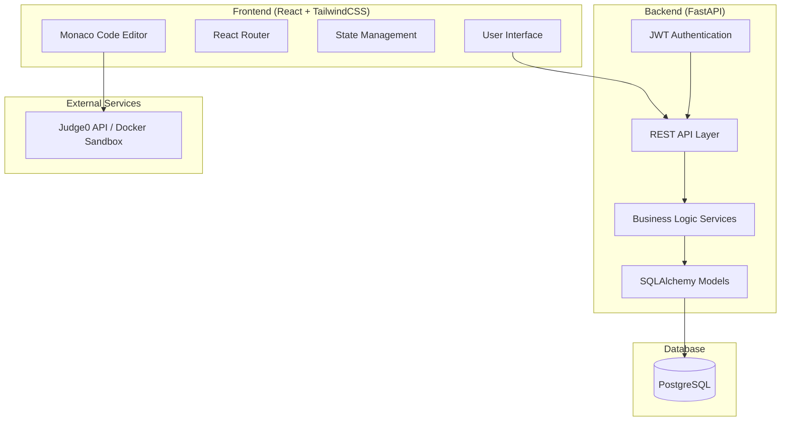

# Design Document

## Overview

CodeCrafts is a full-stack educational programming platform built with React frontend, FastAPI backend, and PostgreSQL database. The system follows a microservice-inspired architecture with clear separation between presentation, business logic, and data layers. The platform implements gamified learning through XP systems, streaks, leaderboards, and competitive duels while providing interactive code execution capabilities.

## Architecture

### System Architecture



### Technology Stack

- **Frontend**: React 18+ with TailwindCSS for styling, React Router for navigation
- **Backend**: FastAPI with SQLAlchemy ORM, Pydantic for data validation
- **Database**: PostgreSQL (with SQLite fallback for development)
- **Authentication**: JWT tokens with bcrypt password hashing
- **Code Execution**: Judge0 API integration with Docker sandbox fallback
- **Development**: Docker Compose for local orchestration

## Components and Interfaces

### Frontend Components

#### Core Layout Components
- **Navbar**: Navigation with user profile, XP display, and streak counter
- **Sidebar**: Course navigation and progress tracking
- **Layout**: Main application wrapper with responsive design

#### Learning Components
- **LessonCard**: Displays lesson metadata, progress, and difficulty
- **TheorySection**: Renders lesson theory with rich text formatting
- **QuestionRenderer**: Polymorphic component handling different question types
- **CodeEditor**: Monaco-based editor with syntax highlighting and execution
- **Flashcard**: Interactive flashcard with flip animations

#### Gamification Components
- **XPBar**: Animated progress bar showing current XP and level
- **StreakDisplay**: Visual streak counter with fire animations
- **Leaderboard**: Ranked list of users with filtering options
- **DuelArena**: Real-time duel interface with timer and progress tracking

#### Progress Components
- **ProgressTracker**: Visual representation of lesson completion
- **ReviewScheduler**: Spaced repetition queue management
- **AchievementBadges**: Unlockable achievements display

### Backend API Endpoints

#### Authentication Routes (`/auth`)
- `POST /auth/register` - User registration
- `POST /auth/login` - User authentication
- `POST /auth/refresh` - Token refresh
- `GET /auth/profile` - User profile retrieval

#### Lesson Routes (`/lessons`)
- `GET /lessons` - List available lessons with filtering
- `GET /lessons/{id}` - Retrieve specific lesson content
- `GET /lessons/{id}/questions` - Get lesson questions
- `POST /lessons/{id}/progress` - Update lesson progress

#### Progress Routes (`/progress`)
- `GET /progress/user/{id}` - User progress overview
- `POST /progress/question` - Submit question answer
- `GET /progress/review` - Get questions due for review
- `POST /progress/review/{id}` - Update review status

#### Gamification Routes (`/game`)
- `GET /game/leaderboard` - Weekly leaderboard data
- `POST /game/duel/create` - Initiate duel
- `GET /game/duel/{id}` - Duel status and results
- `POST /game/duel/{id}/submit` - Submit duel solution

#### Code Execution Routes (`/execute`)
- `POST /execute/run` - Execute code submission
- `GET /execute/status/{id}` - Check execution status
- `GET /execute/result/{id}` - Retrieve execution results

### Service Layer Architecture

#### Authentication Service
- JWT token generation and validation
- Password hashing with bcrypt
- Session management and refresh logic

#### Learning Service
- Lesson content management
- Progress tracking and analytics
- Question randomization and difficulty scaling

#### Spaced Repetition Service
- SM-2 algorithm implementation for review scheduling
- Performance tracking and interval adjustment
- Review queue optimization

#### Code Execution Service
- Judge0 API integration with retry logic
- Docker sandbox management for local execution
- Security sandboxing and resource limits

#### Gamification Service
- XP calculation and level progression
- Streak tracking with timezone handling
- Leaderboard ranking and caching

## Data Models

### User Model
```python
class User(Base):
    id: int (Primary Key)
    username: str (Unique, Index)
    email: str (Unique, Index)
    password_hash: str
    xp: int (Default: 0)
    streak: int (Default: 0)
    last_activity: datetime
    joined_on: datetime
    is_active: bool (Default: True)
```

### Lesson Model
```python
class Lesson(Base):
    id: int (Primary Key)
    language: str (Enum: Python, Cpp)
    title: str
    theory: text
    difficulty: int (1-5 scale)
    xp_reward: int
    order_index: int
    is_published: bool
    created_at: datetime
```

### Question Model
```python
class Question(Base):
    id: int (Primary Key)
    lesson_id: int (Foreign Key -> Lesson)
    type: str (Enum: mcq, fill_blank, flashcard, code)
    question_text: str
    options: JSON (nullable, for MCQ)
    correct_answer: str
    explanation: str (nullable)
    difficulty: int (1-5 scale)
    xp_reward: int
```

### Progress Model
```python
class Progress(Base):
    id: int (Primary Key)
    user_id: int (Foreign Key -> User)
    lesson_id: int (Foreign Key -> Lesson)
    status: str (Enum: not_started, in_progress, completed)
    score: float (0.0-1.0)
    attempts: int
    last_reviewed: datetime
    next_review: datetime (nullable)
    created_at: datetime
    updated_at: datetime
```

### Question Attempt Model
```python
class QuestionAttempt(Base):
    id: int (Primary Key)
    user_id: int (Foreign Key -> User)
    question_id: int (Foreign Key -> Question)
    user_answer: str
    is_correct: bool
    time_taken: int (seconds)
    created_at: datetime
```

### Duel Model
```python
class Duel(Base):
    id: int (Primary Key)
    challenger_id: int (Foreign Key -> User)
    opponent_id: int (Foreign Key -> User, nullable for bots)
    question_id: int (Foreign Key -> Question)
    status: str (Enum: waiting, active, completed)
    winner_id: int (Foreign Key -> User, nullable)
    created_at: datetime
    completed_at: datetime (nullable)
```

## Error Handling

### Frontend Error Handling
- Global error boundary for React component crashes
- API error interceptors with user-friendly messages
- Network connectivity detection and offline mode
- Form validation with real-time feedback
- Code execution timeout handling

### Backend Error Handling
- Custom exception classes for different error types
- HTTP status code standardization (400, 401, 403, 404, 422, 500)
- Structured error responses with error codes and messages
- Request validation using Pydantic models
- Database transaction rollback on failures
- Rate limiting for API endpoints
- Input sanitization for code execution

### Code Execution Security
- Sandboxed execution environment with resource limits
- Input validation and sanitization
- Timeout mechanisms for long-running code
- Memory and CPU usage restrictions
- Network access blocking in sandbox

## Testing Strategy

### Frontend Testing
- **Unit Tests**: Jest and React Testing Library for component testing
- **Integration Tests**: API integration testing with mock services
- **E2E Tests**: Cypress for complete user flow testing
- **Visual Tests**: Storybook for component documentation and visual regression

### Backend Testing
- **Unit Tests**: pytest for service and model testing
- **Integration Tests**: FastAPI TestClient for API endpoint testing
- **Database Tests**: SQLAlchemy testing with test database
- **Performance Tests**: Load testing for code execution endpoints

### Test Data Management
- Factory pattern for test data generation
- Database fixtures for consistent test environments
- Mock external services (Judge0 API)
- Automated test database setup and teardown

### Continuous Integration
- GitHub Actions for automated testing
- Code coverage reporting with pytest-cov
- Linting with ESLint (frontend) and flake8 (backend)
- Type checking with TypeScript and mypy

## Performance Considerations

### Frontend Optimization
- Code splitting with React.lazy for route-based loading
- Memoization of expensive components with React.memo
- Virtual scrolling for large leaderboards and question lists
- Image optimization and lazy loading
- Service worker for offline functionality

### Backend Optimization
- Database query optimization with proper indexing
- Connection pooling for database connections
- Caching frequently accessed data (leaderboards, lesson content)
- Async/await for non-blocking I/O operations
- Background tasks for code execution and email notifications

### Database Optimization
- Proper indexing on frequently queried columns
- Database connection pooling
- Query optimization and EXPLAIN analysis
- Pagination for large result sets
- Database migrations with Alembic

## Security Considerations

### Authentication Security
- JWT tokens with short expiration times
- Refresh token rotation
- Password strength requirements
- Rate limiting on authentication endpoints
- CORS configuration for cross-origin requests

### Code Execution Security
- Sandboxed execution environment
- Resource limits (CPU, memory, time)
- Input validation and sanitization
- Network isolation in execution environment
- Audit logging for code submissions

### Data Protection
- Input validation and sanitization
- SQL injection prevention with parameterized queries
- XSS protection with content security policy
- HTTPS enforcement in production
- Sensitive data encryption at rest